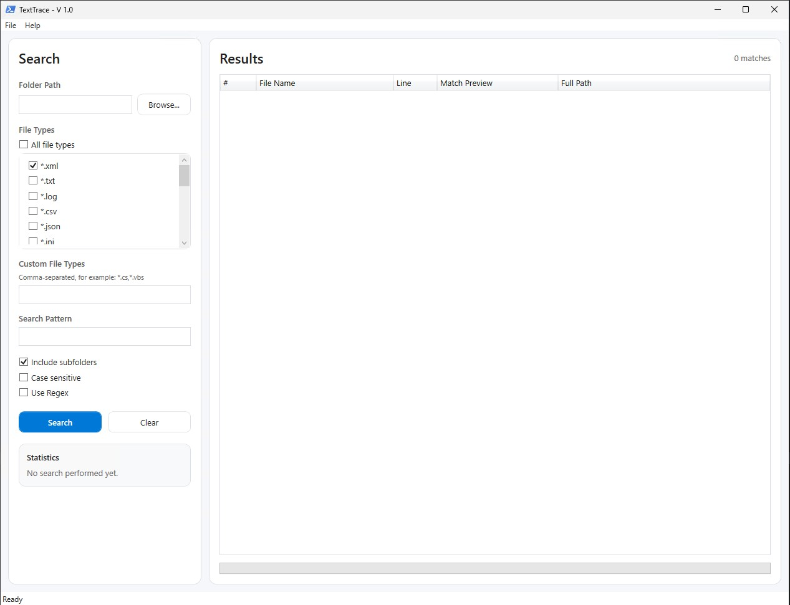
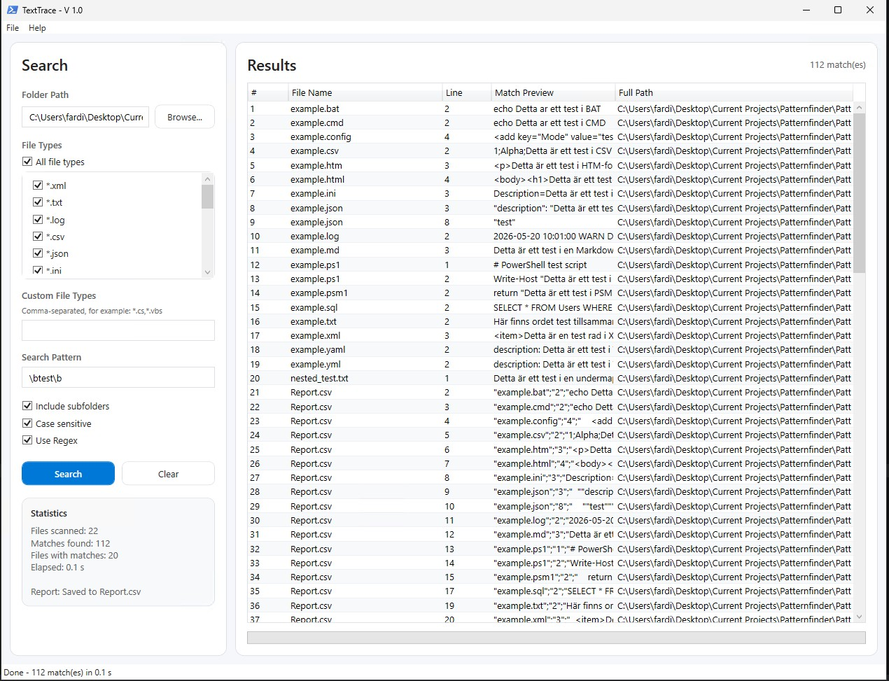
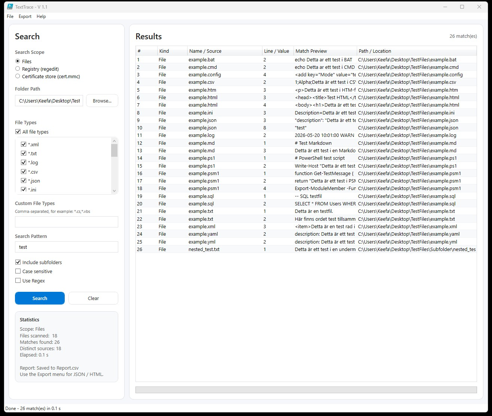
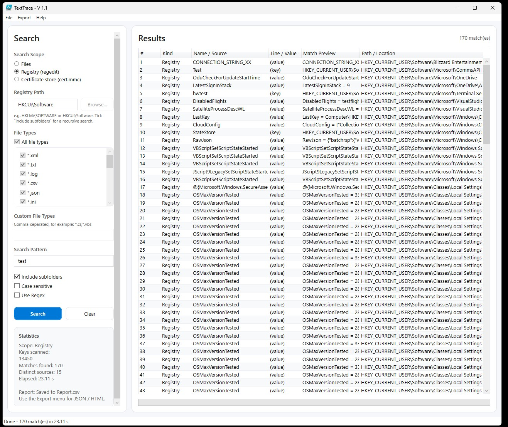
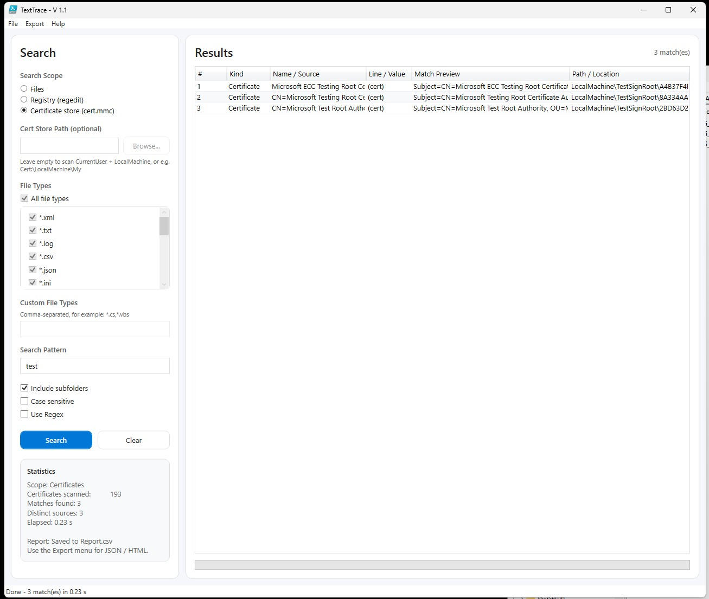

# TextTrace


**TextTrace** is a modern Windows desktop tool for searching text and regex patterns across multiple file types.

It is built with **PowerShell** and **XAML**, and is designed for fast inspection of logs, scripts, configuration files, documentation, SQL files, JSON, XML, and other text-based files.

---

## Table of Contents
- [Features](#features)
- [Screenshots](#screenshots)
- [Regex Examples](#RegexExamples)
- [News](#News)
- [Performance Notes](#PerformanceNotes)
- [Roadmap](#Roadmap)

---

## Features
- Search inside multiple text-based file formats
- Select one, many, or all predefined file types
- Add custom file extensions
- Plain text search
- Regular expression search
- Case-sensitive search option
- Recursive folder scanning
- Result table with file name, line number, preview, and full path
- Right-click context menu for result actions
- Report export
- Search statistics
- Transcript logging for troubleshooting

---

## Screenshots



```
When matches are found, TextTrace exports the results to a CSV file.
Default location: Files\Reports\Report.csv
- UTF-8 encoding
- Semicolon delimiter
- No type information

Report columns:

| Column | Description |
|---|---|
| FileName | Name of the matched file |
| LineNumber | Line number where the match was found |
| Line | Full matching line |
| Path | Full path to the matched file |

---

```


TextTrace includes these file patterns by default:
```text
*.xml
*.txt
*.log
*.csv
*.json
*.ini
*.config
*.html
*.htm
*.ps1
*.psm1
*.bat
*.cmd
*.md
*.yaml
*.yml
*.sql
```
You can also add custom file patterns in the application.
```
Example: *.cs,*.js,*.vbs,*.properties
```




```
Right-click a result row to access available actions:
| Action | Description |
|---|---|
| Open File | Opens the matched file with the default application |
| Open Containing Folder | Opens File Explorer and selects the matched file |
| Open in Notepad | Opens the matched file in Notepad |
| Copy Path | Copies the full file path to the clipboard |
| Open Reports Folder | Opens the report output folder |
```


---
## RegexExamples
```
Enable **Use Regex** before using regex patterns.
Make sure the pattern is valid .NET regular expression syntax.
Examples : 
Find the word `test` anywhere in a line: test
Find the exact word `test`: \btest\b
Find either `error` or `warning`: error|warning
Find lines that start with `ERROR`: ^ERROR
Find an IPv4 address: \b(?:\d{1,3}\.){3}\d{1,3}\b
Find PowerShell variables: \$[A-Za-z_][A-Za-z0-9_]*
Find XML-like tags: <[^>]+>
Find email addresses:\b[A-Za-z0-9._%+-]+@[A-Za-z0-9.-]+\.[A-Za-z]{2,}\b
```
## News
```
1.1 :
Added support for searching within the Windows Registry and Certificate Stores, allowing users to find specific keys, values, or certificates based on their search criteria.
Added support for exporting search results to JSON and HTML formats, in addition to CSV, providing users with more options for analyzing and sharing their findings.
```





## PerformanceNotes
```
TextTrace creates transcript logs for troubleshooting.
TextTrace automatically creates missing `Logs` and `Files\Reports` folders.
TextTrace works best with text-based files. 
Very large folders or very large files may take longer to scan.
```

## Roadmap
```

```


