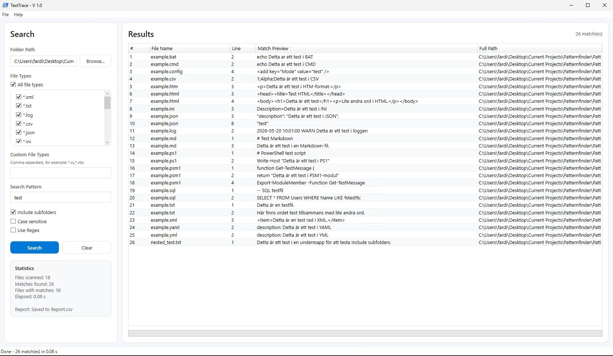
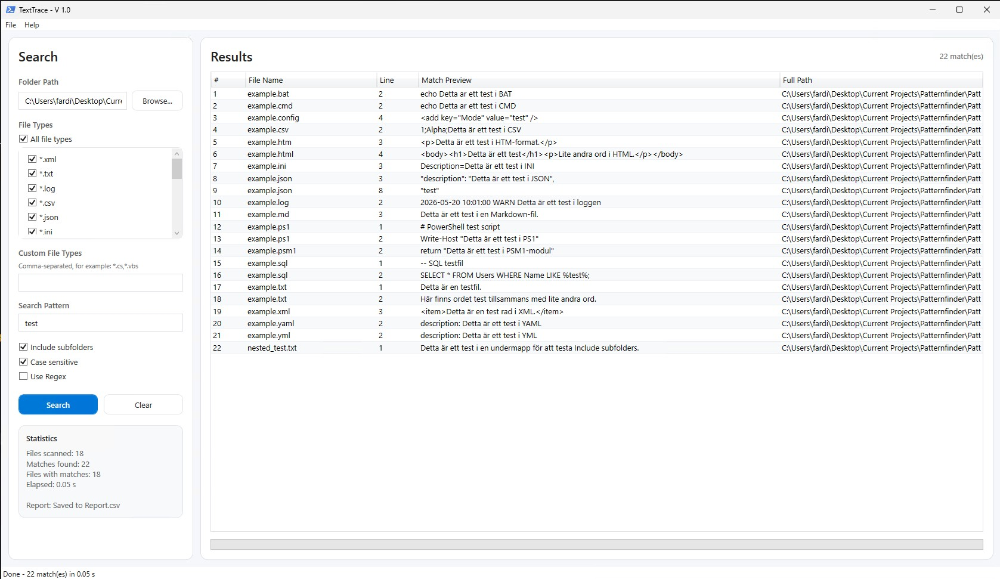
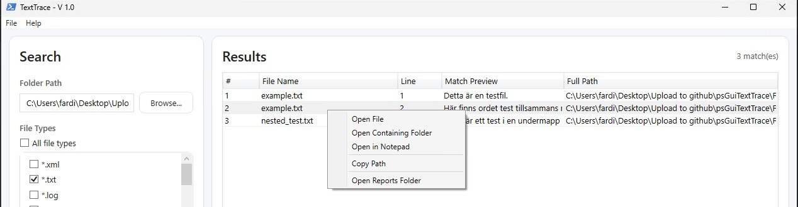

# TextTrace


**TextTrace** is a modern Windows desktop tool for searching text and regex patterns across multiple file types.

It is built with **PowerShell** and **XAML**, and is designed for fast inspection of logs, scripts, configuration files, documentation, SQL files, JSON, XML, and other text-based files.

## News :
### 1.4
```
- some buggfixes.
- HTML report got more funcstions and is more self contained
- Added Firefox, Chrome/Edge Extensions
- Filetypes loades from a file-typ.json
```

### 1.3
```
Must have PowerShell 7.4.0 or later (Core)
Stop button added
Better code in the man script
```

### 1.2
```
1.2 : Added support for exporting search results to JSON and HTML formats, in addition to CSV, providing users with more options for analyzing and sharing their findings.
```

### 1.1
```
1.1 : Added support for searching within the Windows Registry and Certificate Stores, allowing users to find specific keys, values, or certificates based on their search criteria.
```

## System requirements :
### Runtime
```
| Requirement | Detail |
|-------------|--------|
| PowerShell | 7.4.0 or later (Core).
```


---

## Table of Contents
- [News](#news)
- [System requirements](#system)
- [Features](#features)
- [Screenshots](#screenshots)
- [Browser](#browser)
- [Regex Examples](#regexexamples)
- [Performance Notes](#performancenotes)
- [Roadmap](#roadmap)

---

## Features
- Browser addons
- Choose a search scope: Files, Windows Registry, or Certificate store
- Search inside multiple text-based file formats
- Select one, many, or all predefined file types
- Add custom file extensions
- Plain text search
- Regular expression search
- Case-sensitive search option
- Recursive folder scanning
- Result table with file name, line number, preview, and full path
- Right-click context menu for result actions / Not in browsers
- Report export
- Search statistics

---

## Browser


One tool, three builds: **Chrome**, **Microsoft Edge** and **Firefox**.
No install wizard, no indexing, no server. The folder you pick never leaves your machine.

Search text and regex patterns across your local files.
Pick a folder, and the whole tree is searched. Results can be exported to CSV, JSON, or HTML.

### Notes
- **File size — why big files are skipped**
Searching a file in a browser means loading it into the tab's memory. A 400 MB log dropped into a
page doesn't just make the search slow — it can freeze the tab or take the whole browser down with
it.
- **You must pick the folder yourself**, in the browser's own dialog. The extension cannot reach
  arbitrary paths, the registry, certificate stores, or anything you didn't select.
- **The grant lasts one session.** Close the tab or the browser and you reselect the folder next
  time. Nothing keeps standing access to your disk.

### [](#firefox)
**Requires Firefox 115 or newer.**
1. Open `about:debugging#/runtime/this-firefox`.
2. Click **Load Temporary Add-on…**.
3. Select the **`manifest.json`** file inside the `Firefox` folder

### [](#chrome)
1. Open `chrome://extensions`.
2. Turn on **Developer mode** — toggle in the **top-right** corner.
3. Click **Load unpacked** and select the **`Chrome`** folder.
4. Click the TextTrace icon in the toolbar → **Open TextTrace**.

### [](#microsoft-edge)
1. Open `edge://extensions`.
2. Turn on **Developer mode** — toggle at the **bottom left**.
3. Click **Load unpacked** and point it at the **`Edge`** folder.
4. Click the TextTrace icon in the toolbar — the app opens in its own tab (and reuses that tab

### File layout

Each browser has its own self-contained folder. Every file in a build **must stay flat in that
folder** — or at the **root of the ZIP** when packaging — because manifest paths resolve from there.

```
Chrome/                          Edge/                            Firefox/
├── manifest.json   MV3          ├── manifest.json   MV3          ├── manifest.json   MV3 (Gecko, 115+)
├── popup.html      toolbar      ├── background.js   opens the    ├── background.js   opens the
├── popup.js        popup        │                   app in a tab │                   searcher in a tab
├── app.html        main UI      ├── app.html        main UI      ├── index.html      main UI
├── app.css         dark theme   ├── app.css         dark theme   ├── index.css       dark theme
├── app.js          search       ├── app.js          search       ├── app.js          search
├── filetypes.json  defaults     ├── filetypes.json  defaults     ├── filetypes.json  defaults
└── icons/                       └── icons/                       └── icons/
```

###
## Using it

1. Click the toolbar icon to open TextTrace.
2. **Choose folder…** and grant access in the dialog. The folder name appears next to the button.
3. Type your search term in the big field.
4. Set the options:

   | Option | Effect |
   |---|---|
   | **Regex** | Treat the query as a JavaScript regular expression instead of literal text. |
   | **Case-sensitive** | `Error` no longer matches `error`. |
   | **Include subfolders** | Walk the whole tree (on by default). Off = only files directly in the chosen folder. |
   | **File types** | Tick the extensions to scan. **Select all** / **Clear** are shortcuts; **All files** ignores the filter entirely. |
   | **Custom** | Comma-separated extras, e.g. `cs, js, properties`. |

---

## Screenshots


```
When matches are found, TextTrace exports the results to a CSV file.
Default location: Files\Reports\Report.csv
- UTF-8 encoding
- Semicolon delimiter
- No type information

Report columns:

| Column | Description |
|---|---|
| FileName | Name of the matched file |
| LineNumber | Line number where the match was found |
| Line | Full matching line |
| Path | Full path to the matched file |

---

```


TextTrace includes these file patterns by default:
```text
*.xml
*.txt
*.log
*.csv
*.json
*.ini
*.config
*.html
*.htm
*.ps1
*.psm1
*.bat
*.cmd
*.md
*.yaml
*.yml
*.sql
```
You can also add custom file patterns in the application.
```
Example: *.cs,*.js,*.vbs,*.properties
```



```
Right-click a result row to access available actions:
| Action | Description |
|---|---|
| Open File | Opens the matched file with the default application |
| Open Containing Folder | Opens File Explorer and selects the matched file |
| Open in Notepad | Opens the matched file in Notepad |
| Open in Registry Editor | (Registry scope) Opens regedit at the matched key |
| View Certificate | (Certificate scope) Opens the matched certificate |
| Copy Path | Copies the full file path / key path to the clipboard |
| Open Reports Folder | Opens the report output folder |
```



---
## RegexExamples
```
Enable **Use Regex** before using regex patterns.
Make sure the pattern is valid .NET regular expression syntax.
Examples : 
Find the word `test` anywhere in a line: test
Find the exact word `test`: \btest\b
Find either `error` or `warning`: error|warning
Find lines that start with `ERROR`: ^ERROR
Find an IPv4 address: \b(?:\d{1,3}\.){3}\d{1,3}\b
Find PowerShell variables: \$[A-Za-z_][A-Za-z0-9_]*
Find XML-like tags: <[^>]+>
Find email addresses:\b[A-Za-z0-9._%+-]+@[A-Za-z0-9.-]+\.[A-Za-z]{2,}\b
```

## PerformanceNotes
```
TextTrace creates transcript logs for troubleshooting.
TextTrace automatically creates missing `Logs` and `Files\Reports` folders.
TextTrace works best with text-based files. 
Very large folders or very large files may take longer to scan.
```

## Roadmap
```

```


